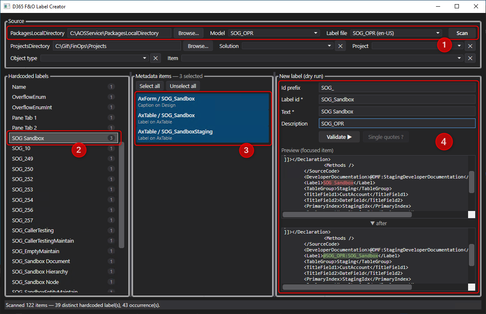

# D365LabelCreator

A Windows desktop tool that finds **hardcoded labels** in a Dynamics 365 Finance & Operations model
and turns them into **defined labels** (`@LabelFileId:LabelId`) — creating the label file entry and
rewriting every place that used the hardcoded text, in one step.

It works directly on the source files under `PackagesLocalDirectory`, so after using it you just
rebuild the model in Visual Studio.

---

## Demo



## Why

In D365 F&O, user-facing text should live in a label file so it can be translated and reused.
In practice models accumulate hardcoded strings — a table field `<Label>Test Date</Label>`, a form
`<Caption>Sales order</Caption>`, an `info("Record created")` in X++. Finding them all, inventing
consistent label ids, adding them to the right `.label.txt`, and replacing each occurrence is slow
and error-prone by hand.

This tool does the finding, the grouping, the naming, and the rewriting — while letting you review
every change before it is written.

---

## Requirements

- Windows with a **D365 F&O development box** (a local `PackagesLocalDirectory`)
- [.NET 8 Desktop Runtime](https://dotnet.microsoft.com/download/dotnet/8.0) (or the SDK to build)

## Build and run

```bash
dotnet build D365LabelCreator.csproj -c Release
dotnet run --project D365LabelCreator.csproj
```

---

## How it works

The top of the window is a set of filters, applied top to bottom. Each step is disabled until the
previous one is set.

### 1. Source

| Filter | Behaviour |
|---|---|
| **PackagesLocalDirectory** | Auto-detected on first launch (well-known paths, then a scan of `<drive>:\AOSService\PackagesLocalDirectory`). Editable, with a Browse button. Remembered. |
| **Model** | Lists only models whose `Descriptor\<Model>.xml` has `<Customization>Allow</Customization>` — i.e. models you are allowed to edit. |
| **Label file** | Every label file of the model, **all languages** (`en-US`, `fr`, …). `en-US` sorts first as the base language. The first entry is preselected. |
| **Scan** | Walks the model and collects every hardcoded label. |

### 2. Optional: Visual Studio solution / project

| Filter | Behaviour |
|---|---|
| **ProjectsDirectory** | A folder containing VS solution folders, scanned recursively for `.sln` files. Remembered. |
| **Solution** | Each `.sln`, with the `.rnrproj` projects it references. Its first project is preselected. |
| **Project** | Shown as `ProjectName (Model)`. Selecting one also selects that project's `<Model>` above. |

When a solution or project is selected, the results are narrowed to the metadata items that project
actually contains (read from its `<Content Include="Type\Name">` entries). Both have a **✕** button
to clear them.

### 3. Optional: object type / item

Two more dropdowns, populated **only from what the scan actually found**, and respecting the filters
above: pick an object type (`Table`, `Form`, `Enum`, `Edt`, …), then one precise object. Both are
✕-clearable, and changing the type resets the item.

---

## Working through the results

- **Hardcoded labels** (left) — the distinct texts found, each with the number of places using it.
- **Metadata items** (middle) — every place that uses the selected text. Multi-select with
  Ctrl/Shift, or **Select all** / **Unselect all**. Files that are read-only on disk are shown in
  **red** (the tool clears the read-only flag when writing).
- **New label** (right) — the id, text and description to create, plus a preview.

Selecting a label automatically selects its first item, so the preview is populated immediately.

### The preview

A git-style inline diff with ~20 lines of context: the **removed** text in red, the **inserted**
`@Reference` in green, surrounding context uncoloured. The pane scrolls to and centres the change,
the two panes scroll together, and the text is selectable.

Nothing is written until you press **Validate**.

### Validate

Creates the label in the selected language's `.label.txt` and rewrites the selected items. Once a
label is fully treated the tool moves to the next one automatically.

### Single quotes ?

For hardcoded strings found in X++ code, sometimes the right answer is "this was never meant to be a
label". This button replaces the surrounding `"` with `'`, leaving the text itself untouched — which
takes the string out of scope, because single-quoted strings are ignored by the scanner (see below).

---

## Detection rules

These rules are deliberate; they are what keeps the noise down.

**A value is already a defined label if its first character is `@`** — those are skipped everywhere.

### XML properties

Scanned: `<Label>`, `<Caption>`, `<HelpText>`, `<Text>`.

- `<Text>` only counts under a form control parent (elsewhere it is not a caption).
- Multi-line values are skipped — they are embedded blobs (for example a report's RDL definition),
  never labels.
- The owning node (table field, form control, enum value, …) is recorded and drives id defaulting.

### X++ code

Scanned inside `<Declaration>` and `<Method><Source>` CDATA, by a small X++ lexer that captures
**only double-quoted `"…"` literals**, and ignores:

- `//`, `///` and `/* … */` comments
- single-quoted `'…'` strings
- anything inside attribute brackets, e.g. `[SysODataAction("GetCustName", true)]`

> The double-quote/single-quote split is the core convention: user-facing text uses `"…"`, while
> technical strings (format specifiers, attribute arguments, method names) use `'…'`. If your
> codebase does not follow this, expect more noise.

### Skipped entirely

`bin`, `Reports`, `Resources`, `XppMetadata`, and the `AxReport` folder.

### Grouping

Identical texts are grouped together, **case-insensitively and ignoring leading/trailing
whitespace**. Whitespace *inside* the text is significant — `"Sales order"` never groups with
`"Salesorder"`.

---

## Label id defaulting

The id is proposed from the element that owns the label:

| Label on | Default id |
|---|---|
| Form control caption / label / text | the control's `<Name>` |
| Table field, or field group | its `<Name>` |
| Enum or enum-extension value | `Object_ValueName` (enum extensions drop their `.ModelName` suffix) |
| Form `<Design>` caption | the form name |
| Anything else (table label, EDT, menu item, …) | the object's file name |
| **X++ code string** | *never defaulted* — there is no meaningful owner, so you name it yourself |

Then:

- **Id prefix** — an optional prefix (e.g. `SOG_`) applied to every defaulted id. It is added at the
  front **unless it already appears anywhere in the id**, so `SOG_Sandbox` is left alone while
  `DateField` becomes `SOG_DateField`. It is remembered between validations and across sessions.
- **HelpText** gets a `_HelpText` suffix, so a help text hangs off the same id as its label
  (`SOG_SalesTypes` / `SOG_SalesTypes_HelpText`).
- **Multiple selection** — if every selected item derives the *same* id, that id is used. If they
  disagree, the field is left blank and required.

### If the id already exists

You are told **live**, in red under the text field, that the id exists and what its current value
is. On Validate you are offered the choice to **reuse** the existing label (nothing new is written,
the items simply point at it) or to change the id.

---

## What gets written

1. The new entry is inserted into the selected language's `.label.txt` at its correct alphabetical
   position, as an `Id=Text` line plus a ` ;Description` line. Existing entries are left byte-for-byte
   untouched.
2. Each selected occurrence is rewritten **in place**: the tool replaces the exact character span of
   the hardcoded text with `@LabelFileId:LabelId`.

Metadata files are treated as **plain text**, not re-serialised XML — so formatting, attribute order
and line endings are preserved and your diffs stay clean. Replacements within a file are applied from
the last to the first, and the offsets of everything still pending are adjusted after each write, so
repeated edits to the same file stay correct. File encoding (UTF-8, with or without BOM) is preserved.

Description defaults to the selected solution's name, or the model name when no solution is selected.

---

## Configuration

Stored per user in `%AppData%\D365LabelCreator\config.json`:

```json
{
  "PackagesLocalDirectory": "C:\\AOSService\\PackagesLocalDirectory",
  "ProjectsDirectory": "C:\\Git\\FinOps\\Projects",
  "IdPrefix": "SOG_"
}
```

---

## Notes and limitations

- **It writes to your source files.** There is no undo — work in source control and review the diff.
  Nothing is written until you press Validate, and the preview shows exactly what will change.
- **Rebuild in Visual Studio** afterwards; the tool only edits source, it does not sync or compile.
- Labels are written to the **selected language only**. If you create a label in `fr`, no `en-US`
  entry is created, and D365 will fall back to showing the label id for users on the base language,
  for quick filling and translations, you can use this other tool I made
  [D365FOLabelDiffTranslatorTool](https://github.com/SogenOvitch/SOG_D365FOLabelDiffTranslatorTool)
- The duplicate-id check looks at the selected language's file only.
- Read-only files have their read-only flag cleared when written; such items are flagged in red
  beforehand.

---

## License

[MIT](LICENSE)
